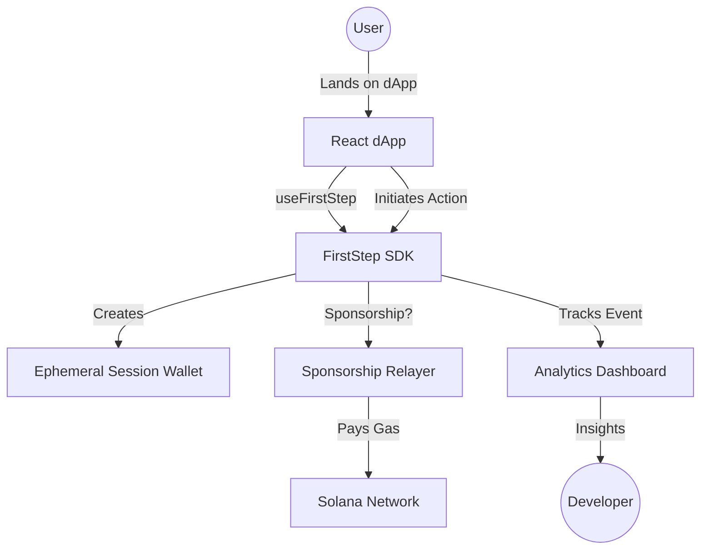

# FirstStep Documentation

Welcome to the comprehensive documentation for **FirstStep**, the plug-and-play SDK designed to eliminate Solana dApp onboarding friction through guest mode and gas-sponsored transactions.

## Table of Contents
1. [Overview & Architecture](#overview--architecture)
2. [Prerequisites](#prerequisites)
3. [Quick Start & Installation](#quick-start--installation)
4. [SDK Usage](#sdk-usage)
5. [Analytics Dashboard](#analytics-dashboard)
6. [Sponsorship Contracts](#sponsorship-contracts)

---

## Overview & Architecture

FirstStep provides an end-to-end suite for developers to seamlessly onboard Web2 users to Solana without requiring them to have a wallet or SOL upfront. 

### The Flow
1. **Guest Mode**: A user accesses the app via a temporary session.
2. **Sponsored Actions**: The app sponsors their first few interactions (configured via on-chain limits).
3. **Progressive Upgrade**: Users are prompted to upgrade to a full wallet (e.g., Phantom, Google Auth) when their free actions run out or they want to claim permanent ownership of their assets.
4. **Analytics**: Every step of this funnel is tracked on the developer dashboard.

### Architecture Diagram


---

## Prerequisites

- **Node.js**: v18+ and `pnpm`
- **Rust + Anchor CLI**: Required if you wish to deploy or modify the sponsorship program.
- **Solana Devnet SOL**: Needed to test the sponsorship pool locally.

---

## Quick Start & Installation

```bash
# Install dependencies across all workspaces
pnpm install

# Build the SDK and React packages
pnpm build

# Run the demo dApp (runs on http://localhost:3000)
pnpm dev --filter demo

# (Optional) Run the Analytics Dashboard (runs on http://localhost:3001)
pnpm dev --filter dashboard
```

---

## SDK Usage

### Basic Setup

The core entry point for the SDK is the `useFirstStep` hook. 

```typescript
import { useFirstStep } from "@firststep/react";
import { GuestModeBanner, GasSponsoredBadge } from "@firststep/react";
import { Transaction } from "@solana/web3.js";

export function MyApp() {
  const {
    isGuest,
    sendTransaction,
    transactionsRemaining,
    initGuest,
    upgradeFromGuest,
  } = useFirstStep({
    appId: "my-app",
    sponsorPolicy: {
      maxTransactionsPerUser: 5,
      maxSpendPerUser: 100000,
      maxSpendPerApp: 1000000,
    },
  });

  const handleFeature = async () => {
    const tx = new Transaction();
    // Build your transaction payload here...
    
    // sendTransaction intelligently determines if the action should be sponsored
    const result = await sendTransaction(tx);
    console.log(`Tx ${result.signature}, sponsored: ${result.sponsored}`);
  };

  return (
    <>
      {isGuest && (
        <GuestModeBanner
          transactionsRemaining={transactionsRemaining}
          onUpgrade={upgradeFromGuest}
        />
      )}

      <button onClick={initGuest}>Try as Guest</button>
      <button onClick={handleFeature} disabled={!isGuest && transactionsRemaining === 0}>
        Do Something
      </button>

      {isGuest && <GasSponsoredBadge sponsored={true} />}
    </>
  );
}
```

### Key Components

- **`GuestModeBanner`**: A floating alert that reminds users they are in guest mode and prompts them to upgrade.
- **`GasSponsoredBadge`**: A simple UI indicator you can place near actions to show they are free/sponsored.
- **`UpgradeModal`**: A built-in modal that guides the user through connecting their persistent wallet.

---

## Analytics Dashboard

FirstStep isn't just about dropping in a wallet—it's about understanding why your users are churning. The dashboard tracks:

1. **Funnel Conversion**: 
   `Landing -> Guest -> Action -> Upgrade`
2. **Sponsorship Costs**: 
   Monitor exactly how much your app is spending on sponsoring users, mapped to their conversion rates.
3. **Drop-off AI**: 
   Basic telemetry analysis to suggest UI/UX fixes (e.g., "70% of users leave at the upgrade prompt. Consider sponsoring 2 more actions.")

---

## Sponsorship Contracts

To prevent abuse (e.g., a bot draining your gas pool), FirstStep comes with an Anchor program located in `programs/sponsorship/`. 

This contract enforces:
- Max transactions per wallet.
- Max SOL spend per wallet.
- Global pool limits per App ID.
