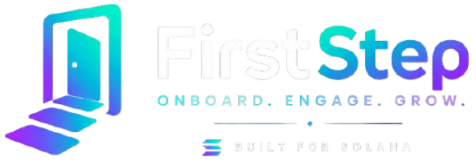

# FirstStep

<p align="center">
  
</p>

**Onboarding & Gas Sponsorship SDK for Solana dApps**

FirstStep is a plug-and-play React SDK designed to solve the **Connect Wallet Churn** problem. By providing instant guest modes, gas-sponsored first transactions, and a rich funnel analytics dashboard, FirstStep ensures users can experience your dApp before they ever hit a friction point.

> **Status**: Live on Devnet & NPM (Hackathon MVP)  
> **Last Updated**: May 2026  
> **Documentation**: See [DOCUMENTATION.md](DOCUMENTATION.md) for full SDK usage and architecture.

---

## 🔗 Live Deployments & Links

* **Devnet Smart Contract**: `7SJc8nfkddM7uFZJZuAkkM2NBsM7EbCGfD5LPXyYwJ1D`
* **NPM Package (SDK)**: [npmjs.com/package/@firststep-solana/sdk](https://www.npmjs.com/package/@firststep-solana/sdk)
* **NPM Package (React)**: [npmjs.com/package/@firststep-solana/react](https://www.npmjs.com/package/@firststep-solana/react)

---

## 🏆 Solana Frontier Hackathon Pitch

In Web3, ~70% of non-crypto users abandon an app because of the friction of setting up a wallet and acquiring SOL just to try a free product.

**FirstStep reverses the funnel:**
1. **Experience First**: Users use your app as a guest immediately.
2. **Sponsored Onboarding**: Their first 3-5 actions are free, covered by an on-chain sponsorship pool.
3. **Upgrade when Hooked**: Users only connect a permanent wallet once they've realized the value of your app.

---

## 🚀 Key Features

- **Guest Mode** — Immediate access without a wallet using ephemeral session keypairs.
- **Sponsored Transactions** — Remove the "Gas Fee" barrier for new users.
- **Embedded Wallets** — Seamless social login integration (email/Google).
- **Analytics Dashboard** — Real-time funnel tracking showing exactly where users drop off.
- **Developer-First SDK** — Drop-in React hooks (`useFirstStep`) and pre-built UI components (`GuestModeBanner`, `GasSponsoredBadge`).

---

## 📚 Documentation

For full instructions on architecture, prerequisites, local setup, and SDK usage, please refer to our dedicated **[DOCUMENTATION.md](DOCUMENTATION.md)** file.

### Quick Start Preview

```bash
# Install dependencies
pnpm install

# Build all packages
pnpm build

# Run demo dApp (http://localhost:3000)
pnpm dev --filter demo
```

---

**Built for Solana Frontier Hackathon. Ship onboarding that doesn't suck.**
