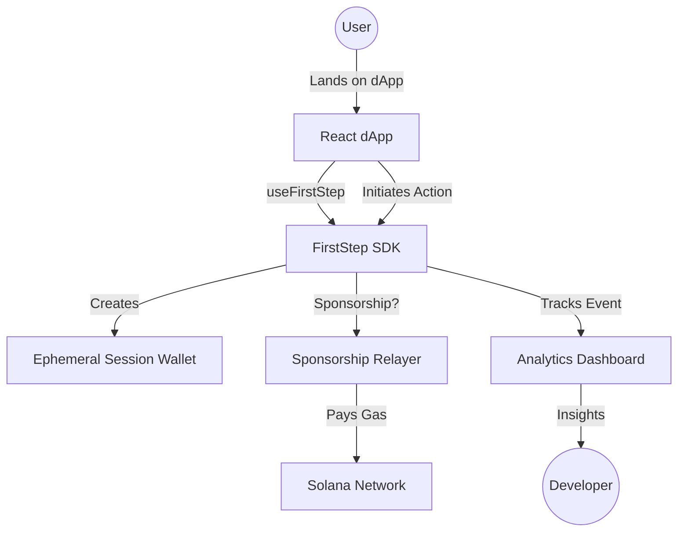

# FirstStep

<p align="center">
  
</p>

**Onboarding & Gas Sponsorship SDK for Solana dApps**

FirstStep is a plug-and-play SDK that gives any Solana dApp guest mode, embedded wallets, sponsored first transactions, and a metrics dashboard to track user onboarding drop-off.

> **Status**: Hackathon MVP (Devnet-ready)  
> **Last Updated**: May 2026  
> **Documentation**: See [plan.txt](plan.txt) for full product spec

---

## 🏆 Solana Frontier Hackathon Pitch

FirstStep solves the **Connect Wallet Churn** problem. In Web3, 70% of users leave before they ever use your app because of the friction of setting up a wallet and buying SOL.

**FirstStep changes the funnel:**
1. **Experience First**: Users use your app as a guest immediately.
2. **Sponsored Onboarding**: Their first 3-5 actions are free, paid by your sponsorship pool.
3. **Upgrade when Hooked**: Users only connect a wallet once they've seen the value.

---

## 🚀 Features

- **Guest Mode** — Immediate access without a wallet using ephemeral session keypairs.
- **Sponsored Transactions** — Remove the "Gas Fee" barrier for new users.
- **Embedded Wallets** — Seamless social login integration (email/Google).
- **Analytics Dashboard** — Real-time funnel tracking showing exactly where users drop off.
- **Developer-First SDK** — Drop-in React hooks that handle everything from tracking to transaction relaying.

## 📊 Analytics Dashboard
Our new integrated dashboard (preview available in the demo) provides actionable insights:
- **Funnel Visualization**: Track Landing -> Guest -> Action -> Upgrade.
- **AI Recommendations**: Suggestions on how to improve conversion rates.
- **Transaction Monitoring**: Real-time view of sponsored vs. user-paid activity.

---

## 🏗️ Architecture



---

## Quick Start

### Prerequisites

- Node.js 18+ and pnpm
- For contract deployment: Rust + Anchor CLI
- For Solana devnet: Devnet SOL (get from faucet)

### Installation & Running

```bash
# Install dependencies
pnpm install

# Build all packages
pnpm build

# Run demo dApp (http://localhost:3000)
pnpm dev --filter demo
```

## Project Structure

```
FirstStep/
├── packages/
│   ├── sdk/              # Core SDK (guest mode, sponsorship, analytics)
│   ├── react/            # React hook & UI components
├── programs/
│   └── sponsorship/      # Anchor program (devnet sponsorship contract)
├── demo/                 # Sample dApp (NFT minting, port 3000)
├── plan.txt              # Product specification
└── .env.example          # Environment variables template
```

---

## SDK Usage

### Basic Setup

```typescript
import { useFirstStep } from "@firststep/react";
import { GuestModeBanner, GasSponsoredBadge } from "@firststep/react";
import { Transaction } from "@solana/web3.js";

export function MyApp() {
  const {
    isGuest,
    sendTransaction,
    transactionsRemaining,
    initGuest,
    upgradeFromGuest,
  } = useFirstStep({
    appId: "my-app",
    sponsorPolicy: {
      maxTransactionsPerUser: 5,
      maxSpendPerUser: 100000,
      maxSpendPerApp: 1000000,
    },
  });

  const handleFeature = async () => {
    const tx = new Transaction();
    // Build your transaction
    const result = await sendTransaction(tx);
    console.log(`Tx ${result.signature}, sponsored: ${result.sponsored}`);
  };

  return (
    <>
      {isGuest && (
        <GuestModeBanner
          transactionsRemaining={transactionsRemaining}
          onUpgrade={upgradeFromGuest}
        />
      )}

      <button onClick={initGuest}>Try as Guest</button>
      <button onClick={handleFeature} disabled={!isGuest && transactionsRemaining === 0}>
        Do Something
      </button>

      {isGuest && <GasSponsoredBadge sponsored={true} />}
    </>
  );
}
```

---

**Built for Solana Frontier Hackathon. Ship onboarding that doesn't suck.**
